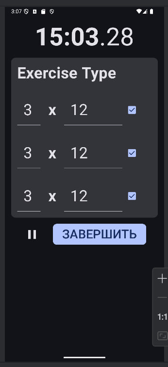

# Приложение для отслеживания тренировок
Проект по дисциплине "разработка мобильных приложений"

Проект был изначально Trainers, но он перестал билдится и выдавал ошибку о недоступности симулятора.
Ошибка ушла только при пересоздании проекта заново, но теперь потерялась история гит до того момента. :(

## Лаб. 4:
Реализовано пять экранов приложения
### 1) StartScreen.kt

* Карточка статистика, нажатие открывает экран History
* Последняя тренировка, нажатие открывает экран TrainingSummary тренировки
* Кнопка "Начать свободную тренировку", нажатие запускает экран TrainingFreestyle
* Кнопка "Начать тренировку по шаблону", нажатие запускает экран TrainingWithTemplate
* Кнопка "Редактор шаблонов", пока не функциональна

### 2) HistoryScreen.kt

* Отображает все сохраненные тренировки внутри LazyColumn
* Нажатие на любую тренировку открывает ее экран TrainingSummary
### 3) TrainingSummary.kt 

* Отображает детали тренировки внутри LazyColumn
### 4) TrainingFreestyle.kt 

Режим свободной тренировки. Функционал который будет реализован в дальнейших лабах:
* Можно добавлять упраженения, менять их названия, количество заходов и выполнений
* Пауза останавливает таймер
* Кнопка "завершить" сохраняет тренировку в приложение
### 5) TrainingWithTemplate.kt 

Режим тренировки по шаблону. Функционал который будет реализован в дальнейших лабах:
* Упражнения отображаются согласно шаблону
* Их можно помечать как выполненные или нет
* Пауза останавливает таймер
* Кнопка "завершить" сохраняет тренировку в приложение
Дополнительно, в CommonUI.kt хранятся элементы, используемые несколькими экранами
Навигация между экранами реализована.
